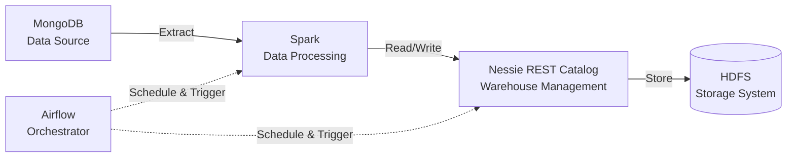

# Train Batch Pipeline

Batch data pipeline untuk mengolah data operasional perkeretaapian (penumpang, stasiun, kereta, rute, dan tiket) dari sumber operasional ke data warehouse dengan pendekatan **Medallion Architecture** (Bronze → Silver → Gold).

## Daftar Isi

- [Arsitektur](#arsitektur)
- [Tech Stack](#tech-stack)
- [Medallion Architecture](#medallion-architecture)
- [Data Model](#data-model)
- [Struktur Konfigurasi Tabel](#struktur-konfigurasi-tabel)
- [Struktur Project](#struktur-project)
- [Instalasi & Setup](#instalasi--setup)
- [Menjalankan Pipeline](#menjalankan-pipeline)
- [Kontribusi](#kontribusi)

## Arsitektur

Pipeline ini berjalan secara batch dengan alur sebagai berikut:



**Alur singkat:**
1. **MongoDB** menyimpan data operasional mentah (source system).
2. **Airflow** menjadwalkan dan men-trigger job secara berkala (batch).
3. **Spark** melakukan extract dari MongoDB, transformasi, dan load data ke tiap layer (Bronze, Silver, Gold).
4. **Nessie REST Catalog** berperan sebagai warehouse/table catalog management (Iceberg-based) untuk versioning dan governance tabel.
5. **HDFS** menjadi lapisan penyimpanan fisik data (data lake).

## Tech Stack

| Komponen | Teknologi |
|---|---|
| Data Source | MongoDB |
| Processing Engine | Apache Spark |
| Table/Warehouse Catalog | Nessie REST Catalog (Apache Iceberg) |
| Storage | HDFS |
| Orchestrator | Apache Airflow |

## Medallion Architecture

Pipeline mengikuti pola 3 layer:

- **Source** — representasi mentah dari struktur data di MongoDB (biasanya field masih dalam bentuk string/loose-typed, contoh: `_id`, `updated_at STRING`).
- **Bronze** — hasil extract dari source dengan casting tipe data yang sudah sesuai (contoh: `updated_at` menjadi `TIMESTAMP`), tanpa transformasi bisnis. Umumnya menggunakan write mode `overwrite_partitions`.
- **Silver** — data yang sudah dibersihkan, dinormalisasi, dan diberi surrogate key (`sk_id`), termasuk penerapan logika **SCD (Slowly Changing Dimension)** sesuai kebutuhan tiap tabel. Write mode bersifat `custom` (merge/update logic spesifik).
- **Gold** *(disiapkan dalam konfigurasi, siap dikembangkan sesuai kebutuhan reporting/analytics)*.

### Tipe SCD per Tabel

| Tabel | Tipe | Keterangan |
|---|---|---|
| `passengers` | SCD2 | History perubahan data penumpang disimpan dengan `is_active`, `start_date`, `end_date` |
| `stations` | SCD1 | Perubahan data menimpa record lama, dengan flag `is_deleted` untuk soft delete |
| `trains` | SCD2 | Sama seperti `passengers`, history disimpan |
| `routes` | SCD1 | Bergantung pada `stations` dan `trains` (lihat `depends_on`), dengan soft delete |
| `tickets` | Fact | Tabel fakta transaksi tiket, partisi berdasarkan `created_at`, full overwrite tiap load |

## Data Model

### 1. `passengers` (SCD2)
Menyimpan data master penumpang beserta history perubahan (nama, gender, telepon, email).

### 2. `stations` (SCD1)
Menyimpan data master stasiun kereta (nama, kota, kode stasiun).

### 3. `trains` (SCD2)
Menyimpan data master kereta beserta history perubahan (nama, tipe, kapasitas).

### 4. `routes` (SCD1)
Menyimpan data rute perjalanan (stasiun asal, tujuan, kereta, jarak, durasi). Bergantung pada tabel `stations` dan `trains` di layer silver.

### 5. `tickets` (Fact)
Tabel fakta transaksi tiket yang menghubungkan `passengers`, `trains`, dan `routes`, lengkap dengan informasi pembayaran, diskon, dan status tiket.

> Detail schema lengkap tiap layer (source/bronze/silver) beserta query transformasi/merge tersedia di file konfigurasi tabel (lihat bagian berikutnya).

## Struktur Konfigurasi Tabel

Definisi setiap tabel (schema per layer, partisi, write mode, query transformasi, dan dependency antar tabel) diatur secara deklaratif dalam file konfigurasi YAML, contoh:

```yaml
tables:
  <nama_tabel>:
    type: scd1 | scd2 | fact
    partitioned_by: <kolom_partisi>
    write_mode:
      bronze: overwrite_partitions
      silver: custom
      gold: custom
    schema:
      source: <ddl source>
      bronze: <ddl bronze>
      silver: <ddl silver>
    query:
      - <query transformasi/merge 1>
      - <query transformasi/merge 2>
    depends_on:
      <tabel_lain>:
        catalog: nessie
        schema: silver
```

Pendekatan config-driven ini memungkinkan pipeline generik yang membaca definisi tabel dari YAML, lalu menjalankan proses extract-load-transform secara otomatis tanpa hardcode logic per tabel di kode Spark job.

> 📌 File konfigurasi lengkap: `config/tables.yaml` *(sesuaikan path dengan struktur project Anda)*

## Struktur Project

> ⚠️ Bagian ini masih berupa contoh umum — beri tahu saya struktur folder Anda yang sebenarnya (atau upload repo/screenshot struktur folder) agar bisa disesuaikan.

```
train-batch-pipeline/
├── dags/                   # Airflow DAGs
├── jobs/                   # Spark job scripts
│   ├── bronze/
│   ├── silver/
│   └── gold/
├── config/
│   └── tables.yaml         # Konfigurasi tabel (schema, SCD, query)
├── requirements.txt
├── docker-compose.yaml     # (jika pakai container untuk local dev)
└── README.md
```

## Instalasi & Setup

> ⚠️ Bagian ini perlu dilengkapi — silakan share requirements.txt / environment variables / cara setup cluster Spark & Nessie yang Anda pakai.

Contoh umum:

```bash
# Clone repository
git clone <repo-url>
cd train-batch-pipeline

# Install dependencies
pip install -r requirements.txt

# Setup environment variables
cp .env.example .env
# isi kredensial MongoDB, endpoint Nessie, HDFS namenode, dll
```

## Menjalankan Pipeline

> ⚠️ Sesuaikan dengan cara trigger DAG di Airflow Anda.

Contoh umum:

```bash
# Trigger DAG secara manual via Airflow CLI
airflow dags trigger train_batch_pipeline

# Atau melalui Airflow Webserver UI
# http://localhost:8080
```

## Kontribusi

Pull request dan issue sangat diterima. Pastikan menjalankan test/validasi schema sebelum submit perubahan pada `config/tables.yaml`.

## Lisensi

*(Tambahkan lisensi project di sini, misal MIT License)*