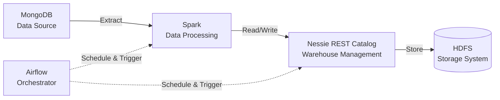
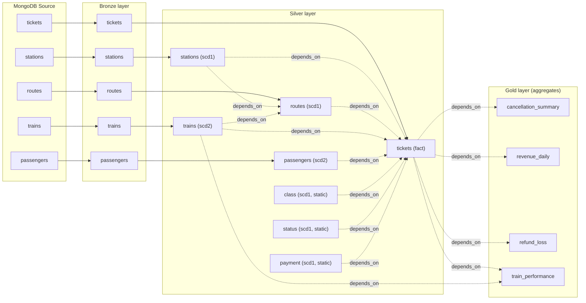
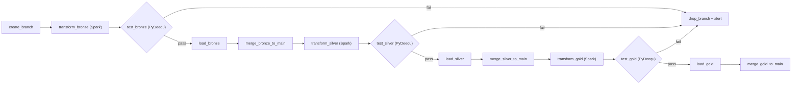

# Train Batch Pipeline

Batch data pipeline for processing train operational data (passengers, stations, trains, routes, and tickets) from operational sources into a data warehouse, using a **Medallion Architecture** (Bronze → Silver → Gold).

## Table of Contents

- [Architecture](#architecture)
- [Table Schema Flow](#table-schema-flow)
- [Tech Stack](#tech-stack)
- [Medallion Architecture](#medallion-architecture)
- [Nessie Branching Strategy](#nessie-branching-strategy)
- [Data Model](#data-model)
- [Table Configuration Structure](#table-configuration-structure)
- [Project Structure](#project-structure)
- [Installation & Setup](#installation--setup)
- [Running the Pipeline](#running-the-pipeline)
- [Contributing](#contributing)

## Architecture

The pipeline runs in batch mode with the following flow:


```mermaid
flowchart LR
    A[MongoDB<br/>Data Source] -->|Extract| B[Spark<br/>Data Processing]
    B -->|Read/Write| C[Nessie REST Catalog<br/>Warehouse Management]
    C -->|Store| D[(HDFS<br/>Storage System)]
    E[Airflow<br/>Orchestrator] -.->|Schedule & Trigger| B
    E -.->|Schedule & Trigger| C
```

**Summary:**
1. **MongoDB** stores raw operational data (source system).
2. **Airflow** schedules and triggers jobs on a batch cadence.
3. **Spark** extracts data from MongoDB, transforms it, and loads it into each layer (Bronze, Silver, Gold).
4. **Nessie REST Catalog** manages the warehouse/table catalog (Iceberg-based) for table versioning and governance.
5. **HDFS** is the physical storage layer (data lake).

## Table Schema Flow
The diagram below shows how each table moves from **Source (MongoDB) → Bronze → Silver → Gold**, plus the dependencies between tables (dashed lines).

`class`, `status`, and `payment` are small **static lookup dimensions** — they're created directly in the Silver layer (no Source/Bronze step) since they hold fixed reference values, not data synced from MongoDB. `routes` depends on `stations` and `trains`, while `tickets` (fact table) depends on nearly every dimension and must run last among the Silver tables. The four **Gold** tables are aggregates built on top of Silver — all of them depend on `tickets`, and `train_performance` also depends on `trains`.


```mermaid
flowchart LR
    subgraph Source["MongoDB Source"]
        S_pass["passengers"]
        S_stat["stations"]
        S_train["trains"]
        S_route["routes"]
        S_tick["tickets"]
    end
    subgraph Bronze["Bronze layer"]
        B_pass["passengers"]
        B_stat["stations"]
        B_train["trains"]
        B_route["routes"]
        B_tick["tickets"]
    end
    subgraph Silver["Silver layer"]
        SV_pass["passengers (scd2)"]
        SV_stat["stations (scd1)"]
        SV_train["trains (scd2)"]
        SV_route["routes (scd1)"]
        SV_tick["tickets (fact)"]
        SV_class["class (scd1, static)"]
        SV_status["status (scd1, static)"]
        SV_payment["payment (scd1, static)"]
    end
    subgraph Gold["Gold layer (aggregates)"]
        G_cancel["cancellation_summary"]
        G_revenue["revenue_daily"]
        G_refund["refund_loss"]
        G_perf["train_performance"]
    end

    S_pass --> B_pass --> SV_pass
    S_stat --> B_stat --> SV_stat
    S_train --> B_train --> SV_train
    S_route --> B_route --> SV_route
    S_tick --> B_tick --> SV_tick

    SV_stat -. depends_on .-> SV_route
    SV_train -. depends_on .-> SV_route

    SV_stat -. depends_on .-> SV_tick
    SV_route -. depends_on .-> SV_tick
    SV_train -. depends_on .-> SV_tick
    SV_pass -. depends_on .-> SV_tick
    SV_class -. depends_on .-> SV_tick
    SV_status -. depends_on .-> SV_tick
    SV_payment -. depends_on .-> SV_tick

    SV_tick -. depends_on .-> G_cancel
    SV_tick -. depends_on .-> G_revenue
    SV_tick -. depends_on .-> G_refund
    SV_tick -. depends_on .-> G_perf
    SV_train -. depends_on .-> G_perf
```

## Tech Stack

| Component | Technology |
|---|---|
| Data Source | MongoDB |
| Processing Engine | Apache Spark |
| Data Quality | PyDeequ |
| Table/Warehouse Catalog | Nessie REST Catalog (Apache Iceberg) |
| Storage | HDFS |
| Orchestrator | Apache Airflow |
| Package/Dependency Management | uv (`pyproject.toml` / `uv.lock`) |

## Medallion Architecture

The pipeline follows a 3-layer pattern:

- **Source** — raw representation of the MongoDB data structure (fields are typically loose-typed strings, e.g. `_id`, `updated_at STRING`).
- **Bronze** — extracted from source with proper type casting (e.g. `updated_at` becomes `TIMESTAMP`), no business transformation. Usually uses `overwrite_partitions` write mode.
- **Silver** — cleaned, normalized data with surrogate keys (`sk_id`), including **SCD (Slowly Changing Dimension)** logic per table. Write mode is `custom` (table-specific merge/update logic). Also hosts static lookup dimensions (`class`, `status`, `payment`) that aren't sourced from MongoDB.
- **Gold** — business-level aggregates for reporting/analytics, built directly from Silver (mainly `tickets`). Write mode is `custom` (`MERGE INTO` on a grain-specific key, e.g. `revenue_date + route_sk_id + class_id`). Owned by the `analytics_team` namespace, with a longer retention (365 days) than Bronze/Silver. Four tables today:
  - `cancellation_summary` — cancellation counts/rate and lost revenue per `booking_date` × `route_sk_id` × `class_id`.
  - `revenue_daily` — gross/net/refunded revenue and average ticket price per `revenue_date` × `route_sk_id` × `class_id`.
  - `refund_loss` — refund volume, amounts, and time-to-refund metrics per `refund_date` × `route_sk_id` × `class_id`.
  - `train_performance` — occupancy, tickets sold/cancelled, and revenue per `departure_date` × `train_sk_id`.

Every layer transition (Bronze, Silver, and Gold) is gated by a **DQ check** — see [Data Quality Checks](#data-quality-checks-pydeequ) below.

## Nessie Branching Strategy

The pipeline uses a **per-stage, per-table** branching strategy in Nessie, with the naming convention: `<stage>_<table_name>`

Example: `bronze_tickets`, `silver_passengers`

**Why:** if one table fails to process or fails its DQ check, we only need to retry that table/stage — not the entire pipeline.

**Flow per stage (Bronze, Silver, or Gold):**
1. Branch `<stage>_<table_name>` is created/reset from `main`.
2. The load task runs on that branch (Spark).
3. The DQ check task runs on that branch (PyDeequ) — separate Airflow task/image from the load task.
4. **DQ passed** → merge branch into `main`.
5. **DQ failed** → branch is dropped, `main` stays consistent, other tables are unaffected, task fails and alerts.

This is handled in `src/utils/nessie_utils.py` as a wrapper around the `run_table` function (`src/app/run_pipeline.py`).

### Data Quality Checks (PyDeequ)

DQ checks run as their **own Airflow task**, using their **own image** — separate from the Spark load task. This keeps load and validation independently retryable and keeps the load image lighter (no need to bundle DQ libraries into the load container).


```mermaid
flowchart LR
    A["create_branch"] --> B["transform_bronze (Spark)"]
    B --> C{"test_bronze (PyDeequ)"}
    C -->|pass| D["load_bronze"]
    D --> E["merge_bronze_to_main"]
    C -->|fail| F["drop_branch + alert"]
    E --> G["transform_silver (Spark)"]
    G --> H{"test_silver (PyDeequ)"}
    H -->|pass| I["load_silver"]
    I --> J["merge_silver_to_main"]
    H -->|fail| F
    J --> K["transform_gold (Spark)"]
    K --> L{"test_gold (PyDeequ)"}
    L -->|pass| M["load_gold"]
    M --> N["merge_gold_to_main"]
    L -->|fail| F
```

This pattern (**create branch → load → DQ check → merge/drop**) repeats independently for the Bronze, Silver, and Gold stage of every table.

**What each DQ stage typically checks:**
- **Bronze DQ** — technical checks: schema/type correctness, null checks on required fields, no duplicate `id`, row count sanity vs. source.
- **Silver DQ** — business checks: SCD consistency (e.g. only one `is_active = true` per `id`), foreign keys resolve to valid dimension rows, referential completeness before a dependent table (like `tickets`) is allowed to run.
- **Gold DQ** — aggregate sanity checks: no negative/impossible metrics (e.g. `cancellation_rate`, `occupancy_rate` within `[0, 1]`), grain uniqueness (one row per `booking_date`/`revenue_date`/`refund_date` × `route_sk_id` × `class_id`, or per `departure_date` × `train_sk_id`), and that upstream `tickets`/`trains` Silver dependencies loaded successfully before aggregating.

### SCD Type per Table

| Table | Type | Notes |
|---|---|---|
| `passengers` | SCD2 | Change history tracked via `is_active`, `start_date`, `end_date` |
| `stations` | SCD1 | Changes overwrite the old record, with an `is_deleted` flag for soft delete |
| `trains` | SCD2 | Same pattern as `passengers`, history is tracked |
| `routes` | SCD1 | Depends on `stations` and `trains` (see `depends_on`), soft delete |
| `class` | SCD1 | Static lookup dimension for ticket class (`id`, `class_name`) |
| `status` | SCD1 | Static lookup dimension for ticket status (`id`, `status`) |
| `payment` | SCD1 | Static lookup dimension for payment method (`id`, `method`) |
| `tickets` | Fact | Ticket transaction fact table, partitioned by `created_at`, full overwrite per load |
| `cancellation_summary` | Aggregate | Gold; grain = `booking_date` × `route_sk_id` × `class_id`; depends on `tickets` |
| `revenue_daily` | Aggregate | Gold; grain = `revenue_date` × `route_sk_id` × `class_id`; depends on `tickets` |
| `refund_loss` | Aggregate | Gold; grain = `refund_date` × `route_sk_id` × `class_id`; depends on `tickets` |
| `train_performance` | Aggregate | Gold; grain = `departure_date` × `train_sk_id`; depends on `tickets` and `trains` |

## Data Model

### 1. `passengers` (SCD2)
Master passenger data with change history (name, gender, phone, email).

### 2. `stations` (SCD1)
Master station data (name, city, station code).

### 3. `trains` (SCD2)
Master train data with change history (name, type, capacity).

### 4. `routes` (SCD1)
Route data (origin/destination station, train, distance, duration). Depends on the `stations` and `trains` Silver tables.

### 5. `class` (SCD1 — static)
Lookup dimension for ticket class, e.g. economy, business, executive. Columns: `id`, `class_name`. Ordered by `id`.

### 6. `status` (SCD1 — static)
Lookup dimension for ticket status, e.g. paid, cancelled, refunded. Columns: `id`, `status`. Ordered by `id`.

### 7. `payment` (SCD1 — static)
Lookup dimension for payment method, e.g. credit card, e-wallet, bank transfer. Columns: `id`, `method`. Ordered by `id`.

### 8. `tickets` (Fact)
Ticket transaction fact table linking `passengers`, `trains`, `routes`, `class`, `status`, and `payment`, along with payment info, discounts, and ticket status.

### 9. `cancellation_summary` (Gold — aggregate)
Daily cancellation metrics per route and class: total tickets created/paid/cancelled/refunded, cancellations before vs. after payment, cancellation rate, lost revenue, and average time-to-cancel. Depends on `tickets`.

### 10. `revenue_daily` (Gold — aggregate)
Daily revenue metrics per route and class: total tickets, gross/net revenue, total discount, refunded revenue, net revenue after refund, and average ticket price. Depends on `tickets`.

### 11. `refund_loss` (Gold — aggregate)
Daily refund metrics per route and class: refunded ticket count, total/average refund amount, and average time from cancellation/creation to refund, including breakdowns for promo and family bookings. Depends on `tickets`.

### 12. `train_performance` (Gold — aggregate)
Per-train, per-departure-date performance: tickets sold/cancelled, net tickets, revenue, family/promo ticket counts, occupancy rate, and a fully-booked flag. Depends on `tickets` and `trains`.

> Full schema details per layer (source/bronze/silver/gold) plus transformation/merge queries are available in the table config file (see next section).

## Table Configuration Structure

Each table's definition (schema per layer, partitioning, write mode, transformation queries, and dependencies) is declared in a YAML config file. The shape differs slightly depending on where the table sits in the pipeline:

**Source-fed tables** (`passengers`, `stations`, `trains`, `routes`, `tickets`) go through `source → bronze → silver`:

```yaml
tables:
  <table_name>:
    type: scd1 | scd2 | fact
    partitioned_by: <partition_column>
    write_mode:
      bronze: overwrite_partitions
      silver: custom
    schema:
      source: <source ddl>
      bronze: <bronze ddl>
      silver: <silver ddl>
    query:
      - <transform/merge query 1>
      - <transform/merge query 2>
    depends_on:
      silver:
        - name: <other_table>
          catalog: nessie
          schema_name: silver
```

**Gold aggregate tables** (`cancellation_summary`, `revenue_daily`, `refund_loss`, `train_performance`) skip `source`/`bronze` entirely — they only define a `gold` schema, built with a `MERGE INTO` on the aggregate's grain, sourced from one or more Silver tables:

```yaml
tables:
  <aggregate_table_name>:
    type: aggregate
    partitioned_by: <date_partition_column>
    write_mode:
      gold: custom
    schema:
      gold: <gold ddl>
    query:
      - <merge query, keyed on the aggregate's grain>
    depends_on:
      gold:
        - name: <silver_table>
          catalog: nessie
          schema_name: silver
```

Static lookup dimensions (`class`, `status`, `payment`) are created directly with plain DDL, e.g.:

```python
"""
CREATE TABLE IF NOT EXISTS nessie.silver.status(
    id INT,
    status STRING
)
USING ICEBERG
""",
"""
ALTER TABLE nessie.silver.status
WRITE ORDERED BY id
""",
```

This config-driven approach enables a generic pipeline that reads table definitions from YAML and runs extract-load-transform automatically, without hardcoding logic per table in the Spark job code.

> 📌 Full config file: [`config/pipeline-config.yaml`](config/pipeline-config.yaml)

## Project Structure

```
.
├── airflow/                      # Airflow orchestration assets (mounted into the airflow docker stack)
│   ├── config/
│   ├── dags/
│   │   └── train_pipeline.py     # Main DAG: bronze/silver branch → load → DQ → merge, per table
│   ├── logs/
│   ├── plugins/
│   └── variables/
│       └── variables.json        # Airflow Variables (e.g. connection/env config for the DAG)
│
├── config/
│   └── pipeline-config.yaml      # Table definitions consumed by the generic pipeline runner
│
├── docker/                       # One docker-compose stack per infrastructure service
│   ├── airflow/                  # Airflow webserver/scheduler
│   ├── hadoop/                   # HDFS namenode + datanode(s)
│   ├── mongo/                    # MongoDB + seed data (passengers, routes, stations, tickets, trains)
│   ├── nessie/                   # Nessie REST catalog + Postgres backing store
│   └── spark/                    # Spark cluster + Jupyter notebook image
│
├── image/                        # Custom image build context/assets
│
├── src/
│   ├── app/                      # Pipeline entrypoints
│   │   ├── bootstrap/
│   │   │   ├── init_nessie.py    # Creates Nessie branches/namespaces on first run
│   │   │   └── init_schema.py    # Creates base table schemas
│   │   ├── run_bootstrap.py      # Entry point for one-time environment bootstrap
│   │   └── run_pipeline.py       # Entry point for running the ETL pipeline (per table)
│   │
│   ├── core/                     # Cross-cutting infrastructure code
│   │   ├── config/
│   │   │   ├── config.py
│   │   │   └── manager/          # Typed config managers: catalog, date, filter, pipeline,
│   │   │                          # schema, source, spark, storage, table
│   │   ├── constant.py
│   │   ├── logger.py
│   │   ├── registry.py           # Registry pattern for extract/transform/load implementations
│   │   └── session.py            # Spark/Nessie session builders
│   │
│   ├── data_quality/             # PyDeequ checks, run as their own Airflow task/image
│   │   ├── base_test.py
│   │   ├── bronze/
│   │   │   └── test_bronze.py
│   │   ├── silver/
│   │   │   └── test_*.py         # Per-table Silver DQ checks
│   │   └── gold/
│   │       └── test_*.py         # Gold DQ checks (cancellation, refund, revenue, performance)
│   │
│   ├── etl/
│   │   ├── extract/
│   │   │   ├── base_extract.py
│   │   │   ├── mongo_extract.py    # Extract from MongoDB (Source)
│   │   │   └── iceberg_extract.py  # Extract from an existing Iceberg/Nessie table
│   │   ├── load/
│   │   │   ├── base_load.py
│   │   │   └── iceberg_load.py     # Load into Nessie/Iceberg tables (per write_mode)
│   │   └── transform/
│   │       ├── base_transform.py
│   │       ├── bronze/
│   │       │   └── bronze_transform.py   # Generic Source → Bronze casting
│   │       ├── silver/
│   │       │   └── *_transform.py        # Per-table Bronze → Silver SCD logic
│   │       └── gold/
│   │           └── *.py                   # Gold aggregations (cancellation, refund, revenue, train performance)
│   │
│   ├── models/                   # Pydantic models backing the config managers
│   │   ├── base_config.py
│   │   ├── data_config.py
│   │   ├── etl_config.py
│   │   ├── pipeline_config.py
│   │   └── spark_config.py
│   │
│   ├── notebooks/
│   │   └── Testes.ipynb          # Ad-hoc exploration notebook
│   │
│   └── utils/
│       ├── filter_utils.py
│       ├── nessie_utils.py       # Branch create/merge/drop wrapper used by run_pipeline
│       ├── table_utils.py
│       └── text_utils.py
│
├── main.py                       # CLI entry point
├── pyproject.toml
├── requirements.txt
├── uv.lock
├── start-all.sh                  # Brings up the docker stacks (mongo, hadoop, nessie, spark, airflow)
├── stop-all.sh                   # Tears down the docker stacks
└── README.md
```

## Installation & Setup

**Prerequisites:**
- Docker + Docker Compose (runs MongoDB, HDFS, Nessie, Spark, and Airflow as separate stacks under `docker/`)
- Python 3.x
- [`uv`](https://docs.astral.sh/uv/) (the project ships a `uv.lock`, so this is the recommended way to install dependencies; a plain `requirements.txt` is also provided as a fallback for `pip`)

**Steps:**

1. **Clone the repository**
   ```bash
   git clone <repo-url>
   cd train_batch_pipeline
   ```

2. **Install Python dependencies**
   ```bash
   # recommended
   uv sync

   # or, with pip
   pip install -r requirements.txt
   ```

3. **Configure environment/pipeline settings**
   - Review `config/pipeline-config.yaml` for table definitions.
   - Review `airflow/variables/variables.json` for Airflow Variables used by the DAG.

4. **Start the infrastructure stack**
   ```bash
   ./start-all.sh
   ```
   This brings up MongoDB (with seeded data under `docker/mongo/init/data`), HDFS (namenode/datanode), the Nessie REST catalog (Postgres-backed), Spark, and Airflow via their respective `docker-compose.yaml` files under `docker/`.

5. **Stop the infrastructure stack**
   ```bash
   ./stop-all.sh
   ```

## Running the Pipeline

**One-time bootstrap** (creates Nessie branches/namespaces and base schemas):
```bash
python -m src.app.run_bootstrap
# or
python src/app/run_bootstrap.py
```

**Run the ETL pipeline manually** (per table, following extract → transform → load → DQ → merge):
```bash
python -m src.app.run_pipeline
# or
python src/app/run_pipeline.py
```

**Run via Airflow (recommended for scheduled/production use):**
1. Ensure the Airflow stack is up (`./start-all.sh`, or `docker/airflow/docker-compose.yaml` directly).
2. Open the Airflow UI and enable the `train_pipeline` DAG (`airflow/dags/train_pipeline.py`).
3. The DAG runs the full create-branch → load → DQ-check → merge/drop flow per table, per stage (Bronze → Silver → Gold), as described in [Nessie Branching Strategy](#nessie-branching-strategy).

> Adjust the exact CLI invocation above to match the arguments defined in `main.py` / `run_pipeline.py` in your codebase — flag if it differs and I can update this section to match exactly.

## Contributing

Pull requests and issues are welcome. Please run schema tests/validation before submitting changes to `config/pipeline-config.yaml`.

## License

*(Add project license here, e.g. MIT License)*
