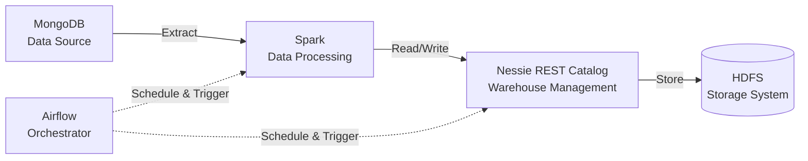
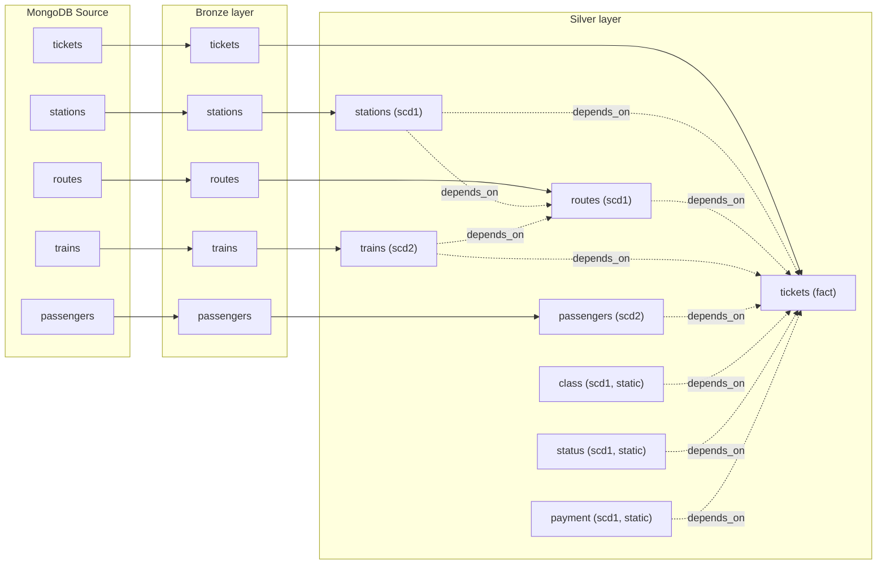
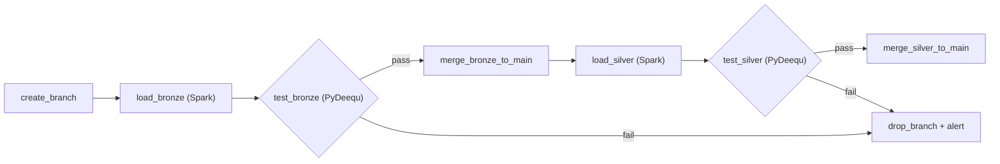

# Train Batch Pipeline

Batch data pipeline for processing train operational data (passengers, stations, trains, routes, and tickets) from operational sources into a data warehouse, using a **Medallion Architecture** (Bronze → Silver → Gold).

## Table of Contents

- [Architecture](#architecture)
- [Table Schema Flow](#table-schema-flow)
- [Tech Stack](#tech-stack)
- [Medallion Architecture](#medallion-architecture)
- [Nessie Branching Strategy](#nessie-branching-strategy)
- [Data Model](#data-model)
- [Table Configuration Structure](#table-configuration-structure)
- [Project Structure](#project-structure)
- [Installation & Setup](#installation--setup)
- [Running the Pipeline](#running-the-pipeline)
- [Contributing](#contributing)

## Architecture

The pipeline runs in batch mode with the following flow:


```mermaid
flowchart LR
    A[MongoDB<br/>Data Source] -->|Extract| B[Spark<br/>Data Processing]
    B -->|Read/Write| C[Nessie REST Catalog<br/>Warehouse Management]
    C -->|Store| D[(HDFS<br/>Storage System)]
    E[Airflow<br/>Orchestrator] -.->|Schedule & Trigger| B
    E -.->|Schedule & Trigger| C
```

**Summary:**
1. **MongoDB** stores raw operational data (source system).
2. **Airflow** schedules and triggers jobs on a batch cadence.
3. **Spark** extracts data from MongoDB, transforms it, and loads it into each layer (Bronze, Silver, Gold).
4. **Nessie REST Catalog** manages the warehouse/table catalog (Iceberg-based) for table versioning and governance.
5. **HDFS** is the physical storage layer (data lake).

## Table Schema Flow
The diagram below shows how each table moves from **Source (MongoDB) → Bronze → Silver**, plus the dependencies between Silver tables (dashed lines).

`class`, `status`, and `payment` are small **static lookup dimensions** — they're created directly in the Silver layer (no Source/Bronze step) since they hold fixed reference values, not data synced from MongoDB. `routes` depends on `stations` and `trains`, while `tickets` (fact table) depends on nearly every dimension and must run last in the Airflow DAG.


```mermaid
flowchart LR
    subgraph Source["MongoDB Source"]
        S_pass["passengers"]
        S_stat["stations"]
        S_train["trains"]
        S_route["routes"]
        S_tick["tickets"]
    end
    subgraph Bronze["Bronze layer"]
        B_pass["passengers"]
        B_stat["stations"]
        B_train["trains"]
        B_route["routes"]
        B_tick["tickets"]
    end
    subgraph Silver["Silver layer"]
        SV_pass["passengers (scd2)"]
        SV_stat["stations (scd1)"]
        SV_train["trains (scd2)"]
        SV_route["routes (scd1)"]
        SV_tick["tickets (fact)"]
        SV_class["class (scd1, static)"]
        SV_status["status (scd1, static)"]
        SV_payment["payment (scd1, static)"]
    end

    S_pass --> B_pass --> SV_pass
    S_stat --> B_stat --> SV_stat
    S_train --> B_train --> SV_train
    S_route --> B_route --> SV_route
    S_tick --> B_tick --> SV_tick

    SV_stat -. depends_on .-> SV_route
    SV_train -. depends_on .-> SV_route

    SV_stat -. depends_on .-> SV_tick
    SV_route -. depends_on .-> SV_tick
    SV_train -. depends_on .-> SV_tick
    SV_pass -. depends_on .-> SV_tick
    SV_class -. depends_on .-> SV_tick
    SV_status -. depends_on .-> SV_tick
    SV_payment -. depends_on .-> SV_tick
```

## Tech Stack

| Component | Technology |
|---|---|
| Data Source | MongoDB |
| Processing Engine | Apache Spark |
| Data Quality | PyDeequ |
| Table/Warehouse Catalog | Nessie REST Catalog (Apache Iceberg) |
| Storage | HDFS |
| Orchestrator | Apache Airflow |

## Medallion Architecture

The pipeline follows a 3-layer pattern:

- **Source** — raw representation of the MongoDB data structure (fields are typically loose-typed strings, e.g. `_id`, `updated_at STRING`).
- **Bronze** — extracted from source with proper type casting (e.g. `updated_at` becomes `TIMESTAMP`), no business transformation. Usually uses `overwrite_partitions` write mode.
- **Silver** — cleaned, normalized data with surrogate keys (`sk_id`), including **SCD (Slowly Changing Dimension)** logic per table. Write mode is `custom` (table-specific merge/update logic). Also hosts static lookup dimensions (`class`, `status`, `payment`) that aren't sourced from MongoDB.
- **Gold** *(configured but not yet built out — ready for reporting/analytics needs)*.

Every layer transition (Bronze and Silver) is gated by a **DQ check** — see [Data Quality Checks](#data-quality-checks-pydeequ) below.

## Nessie Branching Strategy

The pipeline uses a **per-stage, per-table** branching strategy in Nessie, with the naming convention: `<stage>_<table_name>`

Example: `bronze_tickets`, `silver_passengers`

**Why:** if one table fails to process or fails its DQ check, we only need to retry that table/stage — not the entire pipeline.

**Flow per stage (Bronze or Silver):**
1. Branch `<stage>_<table_name>` is created/reset from `main`.
2. The load task runs on that branch (Spark).
3. The DQ check task runs on that branch (PyDeequ) — separate Airflow task/image from the load task.
4. **DQ passed** → merge branch into `main`.
5. **DQ failed** → branch is dropped, `main` stays consistent, other tables are unaffected, task fails and alerts.

This is handled in `src/utils/nessie_utils.py` as a wrapper around the `run_table` function (`src/app/run_pipeline.py`).

### Data Quality Checks (PyDeequ)

DQ checks run as their **own Airflow task**, using their **own image** — separate from the Spark load task. This keeps load and validation independently retryable and keeps the load image lighter (no need to bundle DQ libraries into the load container).


```mermaid
flowchart LR
    A["create_branch"] --> B["load_bronze (Spark)"]
    B --> C{"test_bronze (PyDeequ)"}
    C -->|pass| D["merge_bronze_to_main"]
    C -->|fail| E["drop_branch + alert"]
    D --> F["load_silver (Spark)"]
    F --> G{"test_silver (PyDeequ)"}
    G -->|pass| H["merge_silver_to_main"]
    G -->|fail| E
```

This pattern (**create branch → load → DQ check → merge/drop**) repeats independently for the Bronze stage and the Silver stage of every table.

**What each DQ stage typically checks:**
- **Bronze DQ** — technical checks: schema/type correctness, null checks on required fields, no duplicate `id`, row count sanity vs. source.
- **Silver DQ** — business checks: SCD consistency (e.g. only one `is_active = true` per `id`), foreign keys resolve to valid dimension rows, referential completeness before a dependent table (like `tickets`) is allowed to run.

### SCD Type per Table

| Table | Type | Notes |
|---|---|---|
| `passengers` | SCD2 | Change history tracked via `is_active`, `start_date`, `end_date` |
| `stations` | SCD1 | Changes overwrite the old record, with an `is_deleted` flag for soft delete |
| `trains` | SCD2 | Same pattern as `passengers`, history is tracked |
| `routes` | SCD1 | Depends on `stations` and `trains` (see `depends_on`), soft delete |
| `class` | SCD1 | Static lookup dimension for ticket class (`id`, `class_name`) |
| `status` | SCD1 | Static lookup dimension for ticket status (`id`, `status`) |
| `payment` | SCD1 | Static lookup dimension for payment method (`id`, `method`) |
| `tickets` | Fact | Ticket transaction fact table, partitioned by `created_at`, full overwrite per load |

## Data Model

### 1. `passengers` (SCD2)
Master passenger data with change history (name, gender, phone, email).

### 2. `stations` (SCD1)
Master station data (name, city, station code).

### 3. `trains` (SCD2)
Master train data with change history (name, type, capacity).

### 4. `routes` (SCD1)
Route data (origin/destination station, train, distance, duration). Depends on the `stations` and `trains` Silver tables.

### 5. `class` (SCD1 — static)
Lookup dimension for ticket class, e.g. economy, business, executive. Columns: `id`, `class_name`. Ordered by `id`.

### 6. `status` (SCD1 — static)
Lookup dimension for ticket status, e.g. paid, cancelled, refunded. Columns: `id`, `status`. Ordered by `id`.

### 7. `payment` (SCD1 — static)
Lookup dimension for payment method, e.g. credit card, e-wallet, bank transfer. Columns: `id`, `method`. Ordered by `id`.

### 8. `tickets` (Fact)
Ticket transaction fact table linking `passengers`, `trains`, `routes`, `class`, `status`, and `payment`, along with payment info, discounts, and ticket status.

> Full schema details per layer (source/bronze/silver) plus transformation/merge queries are available in the table config file (see next section).

## Table Configuration Structure

Each table's definition (schema per layer, partitioning, write mode, transformation queries, and dependencies) is declared in a YAML config file, for example:

```yaml
tables:
  <table_name>:
    type: scd1 | scd2 | fact
    partitioned_by: <partition_column>
    write_mode:
      bronze: overwrite_partitions
      silver: custom
      gold: custom
    schema:
      source: <source ddl>
      bronze: <bronze ddl>
      silver: <silver ddl>
    query:
      - <transform/merge query 1>
      - <transform/merge query 2>
    depends_on:
      <other_table>:
        catalog: nessie
        schema: silver
```

Static lookup dimensions (`class`, `status`, `payment`) are created directly with plain DDL, e.g.:

```python
"""
CREATE TABLE IF NOT EXISTS nessie.silver.status(
    id INT,
    status STRING
)
USING ICEBERG
""",
"""
ALTER TABLE nessie.silver.status
WRITE ORDERED BY id
""",
```

This config-driven approach enables a generic pipeline that reads table definitions from YAML and runs extract-load-transform automatically, without hardcoding logic per table in the Spark job code.

> 📌 Full config file: `config/tables.yaml` *(adjust the path to match your project structure)*

## Contributing

Pull requests and issues are welcome. Please run schema tests/validation before submitting changes to `config/tables.yaml`.

## License

*(Add project license here, e.g. MIT License)*
