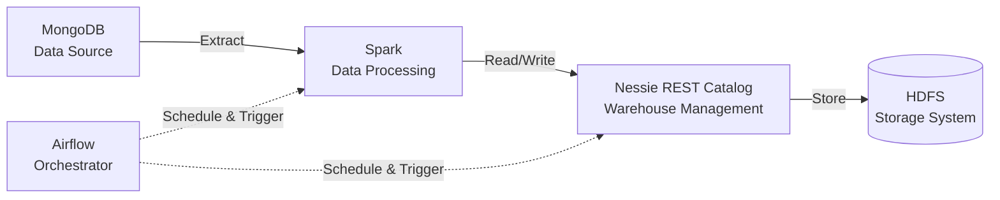
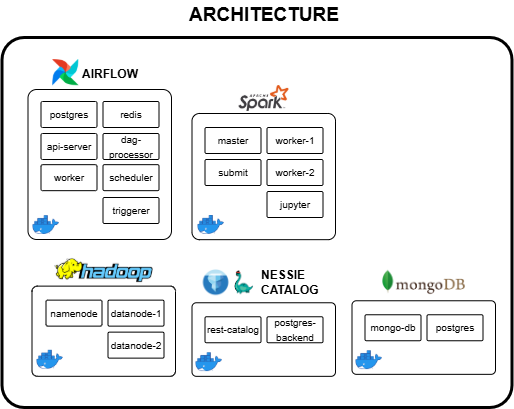
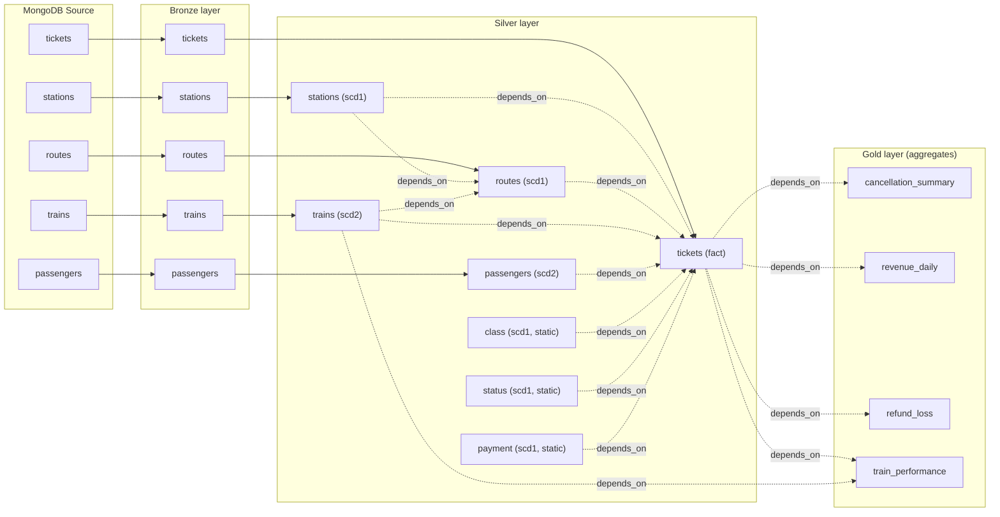
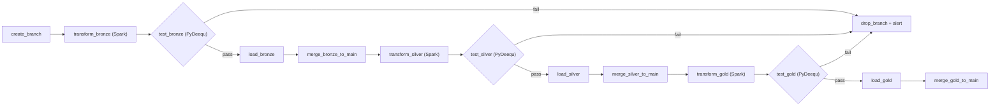
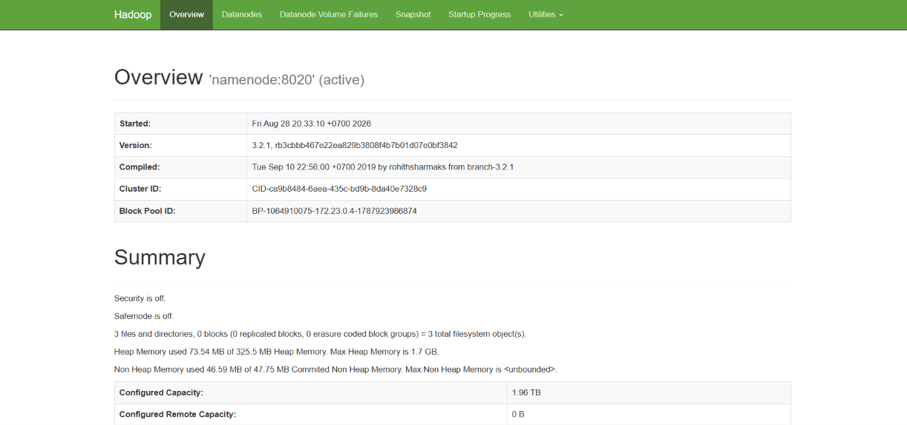
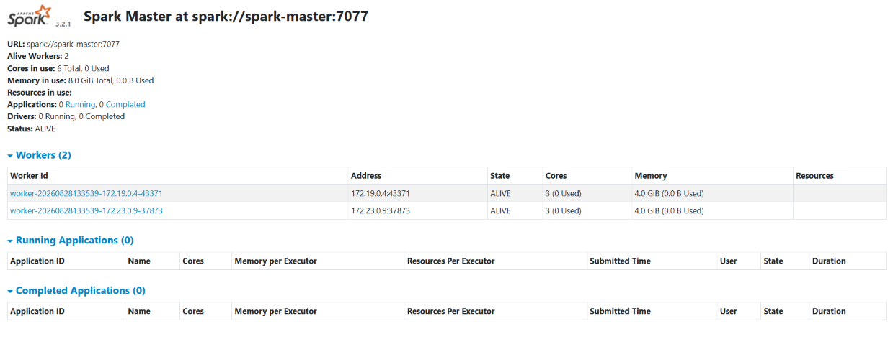
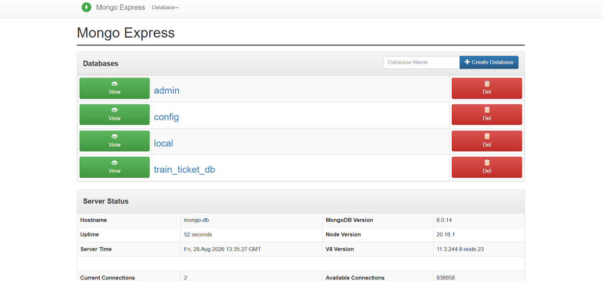
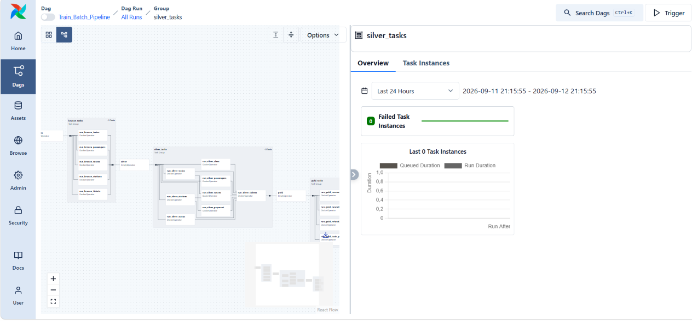
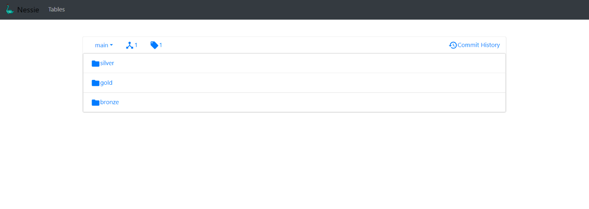

# Train Batch Pipeline

Batch data pipeline for processing train operational data (passengers, stations, trains, routes, and tickets) from operational sources into a data warehouse, using a **Medallion Architecture** (Bronze → Silver → Gold).

## Table of Contents

- [Architecture](#architecture)
- [Table Schema Flow](#table-schema-flow)
- [Tech Stack](#tech-stack)
- [Medallion Architecture](#medallion-architecture)
- [Nessie Branching Strategy](#nessie-branching-strategy)
- [Data Model](#data-model)
- [Project Structure](#project-structure)
- [Preview](#preview)
- [Installation & Running](#installation--running)
- [Contributing](#contributing)

## Architecture

### Pipeline Flow (logical)


```mermaid
flowchart LR
    A[MongoDB<br/>Data Source] -->|Extract| B[Spark<br/>Data Processing]
    B -->|Read/Write| C[Nessie REST Catalog<br/>Warehouse Management]
    C -->|Store| D[(HDFS<br/>Storage System)]
    E[Airflow<br/>Orchestrator] -.->|Schedule & Trigger| B
    E -.->|Schedule & Trigger| C
```

1. **MongoDB** — raw operational data (source system).
2. **Airflow** — schedules and triggers jobs on a batch cadence.
3. **Spark** — extracts data from MongoDB, transforms it, and loads it into each layer (Bronze/Silver/Gold).
4. **Nessie REST Catalog** — manages the warehouse/table catalog (Iceberg-based) for table versioning and governance.
5. **HDFS** — the physical storage layer (data lake).

### Infrastructure / Deployment (Docker network)



All services run as separate Docker Compose stacks, but are joined into one overarching network, **`DATA_ENG_NET`**, so they can communicate across stacks. Each stack also has its own internal network (`*_NET`) for communication between containers within that stack.


| Stack | Network | Container | Role |
|---|---|---|---|
| **Airflow** | `AIRFLOW_NET` | Postgres | Metadata DB (DAG runs, task instances, variables, connections, XCom) |
| | | Redis | Message broker for CeleryExecutor (task queue for workers) |
| | | Api Server | Airflow Web UI (monitoring, triggering, logs) |
| | | Dag Processor | Parses DAG files, decoupled from the scheduler (Airflow 2.x+) |
| | | Scheduler | Reads DAGs, determines which tasks are ready to run |
| | | Worker | Executes tasks (Celery worker) |
| | | Triggerer | Runs deferred tasks/sensors asynchronously |
| **Spark** | `SPARK_NET` | Master | Spark cluster coordinator |
| | | Worker_1, Worker_2 | Runs Spark executors |
| | | Submit | Client used to `spark-submit` jobs from the pipeline/Airflow |
| | | Jupyter | Notebook for ad-hoc exploration/debugging (`src/notebooks`) |
| **Hadoop** | `HADOOP_NET` | Namenode | HDFS metadata (directory structure, block locations) |
| | | Datanode_1, Datanode_2 | Physical HDFS data block storage |
| **Nessie** | `NESSIE_NET` | Rest Catalog | Iceberg catalog (branching, table versioning) |
| | | Postgres | Backing store for Nessie metadata |
| **Mongo** | `MONGO_NET` | Mongo DB | Operational data source (source system) |
| | | Mongo Express | Web UI to browse/inspect Mongo data |

**Why split per-network and then join under `DATA_ENG_NET`?**
- Isolation: each stack (`docker/airflow`, `docker/spark`, etc.) can be brought up/down independently without affecting the others.
- Still able to reach each other: since every stack is joined to `DATA_ENG_NET`, Airflow can reach the Spark master, Spark can reach Nessie & HDFS, etc. — matching the logical pipeline flow above.
- Easier debugging: if one stack has issues, its network can be inspected/isolated on its own.

## Table Schema Flow

How each table moves from **Source (MongoDB) → Bronze → Silver → Gold**, plus dependencies between tables (dashed lines).

`class`, `status`, and `payment` are small **static lookup dimensions** — created directly in the Silver layer (no Source/Bronze step) since they hold fixed reference values. `routes` depends on `stations` and `trains`, while `tickets` (fact table) depends on nearly every dimension and runs last among the Silver tables. The four **Gold** tables are aggregates on top of Silver — all depend on `tickets`, and `train_performance` also depends on `trains`.


```mermaid
flowchart LR
    subgraph Source["MongoDB Source"]
        S_pass["passengers"]
        S_stat["stations"]
        S_train["trains"]
        S_route["routes"]
        S_tick["tickets"]
    end
    subgraph Bronze["Bronze layer"]
        B_pass["passengers"]
        B_stat["stations"]
        B_train["trains"]
        B_route["routes"]
        B_tick["tickets"]
    end
    subgraph Silver["Silver layer"]
        SV_pass["passengers (scd2)"]
        SV_stat["stations (scd1)"]
        SV_train["trains (scd2)"]
        SV_route["routes (scd1)"]
        SV_tick["tickets (fact)"]
        SV_class["class (scd1, static)"]
        SV_status["status (scd1, static)"]
        SV_payment["payment (scd1, static)"]
    end
    subgraph Gold["Gold layer (aggregates)"]
        G_cancel["cancellation_summary"]
        G_revenue["revenue_daily"]
        G_refund["refund_loss"]
        G_perf["train_performance"]
    end

    S_pass --> B_pass --> SV_pass
    S_stat --> B_stat --> SV_stat
    S_train --> B_train --> SV_train
    S_route --> B_route --> SV_route
    S_tick --> B_tick --> SV_tick

    SV_stat -. depends_on .-> SV_route
    SV_train -. depends_on .-> SV_route
    SV_stat -. depends_on .-> SV_tick
    SV_route -. depends_on .-> SV_tick
    SV_train -. depends_on .-> SV_tick
    SV_pass -. depends_on .-> SV_tick
    SV_class -. depends_on .-> SV_tick
    SV_status -. depends_on .-> SV_tick
    SV_payment -. depends_on .-> SV_tick

    SV_tick -. depends_on .-> G_cancel
    SV_tick -. depends_on .-> G_revenue
    SV_tick -. depends_on .-> G_refund
    SV_tick -. depends_on .-> G_perf
    SV_train -. depends_on .-> G_perf
```

## Tech Stack

| Component | Technology |
|---|---|
| Data Source | MongoDB |
| Processing Engine | Apache Spark |
| Data Quality | PyDeequ |
| Table/Warehouse Catalog | Nessie REST Catalog (Apache Iceberg) |
| Storage | HDFS |
| Orchestrator | Apache Airflow |
| Package Management | uv (`pyproject.toml` / `uv.lock`) |

## Medallion Architecture

- **Source** — raw representation of the MongoDB data structure (fields are typically loose-typed strings).
- **Bronze** — extracted from source with proper type casting, no business transformation. Write mode `overwrite_partitions`.
- **Silver** — cleaned, normalized data with surrogate keys (`sk_id`) and **SCD (Slowly Changing Dimension)** logic per table. Write mode `custom`. Also hosts static lookup dimensions (`class`, `status`, `payment`).
- **Gold** — business-level aggregates for reporting, built directly from Silver (mainly `tickets`). Write mode `custom` (`MERGE INTO` on a grain-specific key, e.g. `revenue_date + route_sk_id + class_id`). Owned by the `analytics_team` namespace, with 365-day retention.

Every layer transition (Bronze/Silver/Gold) is gated by a **DQ check** (see below).

### Gold tables

| Table | Grain | Contents |
|---|---|---|
| `cancellation_summary` | `booking_date` × `route_sk_id` × `class_id` | Cancellation counts/rate and lost revenue |
| `revenue_daily` | `revenue_date` × `route_sk_id` × `class_id` | Gross/net/refunded revenue, average ticket price |
| `refund_loss` | `refund_date` × `route_sk_id` × `class_id` | Refund volume, amounts, time-to-refund |
| `train_performance` | `departure_date` × `train_sk_id` | Occupancy, tickets sold/cancelled, revenue |

## Nessie Branching Strategy

A **per-stage, per-table** branching strategy: `<stage>_<table_name>` (e.g. `bronze_tickets`, `silver_passengers`).

**Why:** if one table fails to process or fails its DQ check, only that table/stage needs to be retried — not the entire pipeline.


```mermaid
flowchart LR
    A["create_branch"] --> B["transform_bronze (Spark)"]
    B --> C{"test_bronze (PyDeequ)"}
    C -->|pass| D["load_bronze"] --> E["merge_bronze_to_main"]
    C -->|fail| F["drop_branch + alert"]
    E --> G["transform_silver (Spark)"]
    G --> H{"test_silver (PyDeequ)"}
    H -->|pass| I["load_silver"] --> J["merge_silver_to_main"]
    H -->|fail| F
    J --> K["transform_gold (Spark)"]
    K --> L{"test_gold (PyDeequ)"}
    L -->|pass| M["load_gold"] --> N["merge_gold_to_main"]
    L -->|fail| F
```

DQ checks run as their **own Airflow task and image**, separate from the Spark load task — keeping load and validation independently retryable, and keeping the load image lighter.

- **Bronze DQ** — schema/type checks, null checks, no duplicate `id`, row count sanity vs. source.
- **Silver DQ** — SCD consistency (only one `is_active=true` per `id`), foreign keys resolve to valid dimension rows, referential completeness before `tickets` runs.
- **Gold DQ** — no negative/impossible metrics (`cancellation_rate`, `occupancy_rate` ∈ [0,1]), grain uniqueness, upstream Silver dependencies loaded successfully.

## Data Model

| Table | Type | Notes |
|---|---|---|
| `passengers` | SCD2 | History tracked via `is_active`, `start_date`, `end_date` |
| `stations` | SCD1 | Overwrite + `is_deleted` (soft delete) |
| `trains` | SCD2 | Same pattern as `passengers` |
| `routes` | SCD1 | Depends on `stations`, `trains`; soft delete |
| `class` | SCD1 (static) | Ticket class lookup (`id`, `class_name`) |
| `status` | SCD1 (static) | Ticket status lookup (`id`, `status`) |
| `payment` | SCD1 (static) | Payment method lookup (`id`, `method`) |
| `tickets` | Fact | Partitioned by `created_at`, full overwrite per load |
| `cancellation_summary` | Aggregate (Gold) | Depends on `tickets` |
| `revenue_daily` | Aggregate (Gold) | Depends on `tickets` |
| `refund_loss` | Aggregate (Gold) | Depends on `tickets` |
| `train_performance` | Aggregate (Gold) | Depends on `tickets`, `trains` |

> Full schema details and transform/merge queries are available in [`config/pipeline-config.yaml`](config/pipeline-config.yaml).

## Project Structure

```
.
├── airflow/                # Airflow assets (dags, config, plugins, variables)
├── config/pipeline-config.yaml   # Table definitions (schema, write mode, deps, query)
├── docker/                 # One docker-compose stack per service: airflow, hadoop, mongo, nessie, spark
├── image/                  # Custom image build context
├── src/
│   ├── app/                 # Entrypoints: bootstrap (Nessie/schema init) & pipeline runner
│   ├── core/                 # Config managers, registry, Spark/Nessie session builders
│   ├── data_quality/         # PyDeequ checks (bronze/silver/gold), own task/image
│   ├── etl/                  # extract (mongo/iceberg) → transform (bronze/silver/gold) → load
│   ├── models/                # Pydantic models backing the config managers
│   └── utils/                 # nessie branch wrapper, table/text/filter utils
├── main.py                 # CLI entry point (PipelineRunner)
├── start-all.sh / stop-all.sh
└── pyproject.toml / uv.lock / requirements.txt
```

## Preview

<table>
  <tr>
    <td></td>
    <td></td>
    <td></td>
    <td></td>
    <td></td>
  </tr>
  <tr>
    <td align="center">Hadoop UI</td>
    <td align="center">Spark Master UI</td>
    <td align="center">Mongo UI</td>
    <td align="center">Airflow UI</td>
    <td align="center">Nessie Rest UI</td>
  </tr>
</table>

## Installation & Running

**Prerequisites:** Docker + Docker Compose, Python 3.x, [`uv`](https://docs.astral.sh/uv/) (fallback: `pip install -r requirements.txt`).

```bash
git clone <repo-url> && cd train_batch_pipeline
uv sync                        # install dependencies
./start-all.sh                 # up: mongo, hdfs, nessie, spark, airflow
```

### CLI (`main.py`)

| Flag | Env fallback | Required? | Description |
|---|---|---|---|
| `-stg` | — | Always | `bronze` \| `silver` \| `gold` |
| `-cfg` | `CONFIG_PATH` | Yes | Path to the pipeline config YAML |
| `-env` | `ENV_PATH` | Yes | Path to the env file (Mongo/Nessie/HDFS/Spark connections) |
| `-start` / `-end` | `START_DATE` / `END_DATE` | Yes (unless `--run_bootstrap`) | Run date range |
| `-tbl` | — | No | Specific table(s) (default: every table in that stage) |
| `--run_bootstrap` | — | No | Sets up Nessie branches/namespaces + base schemas |
| `--data_quality` | — | No | Runs PyDeequ DQ checks for the processed tables |

**Example — run the Silver stage for specific tables with DQ checks:**
```bash
python -m src.app.run_pipeline -stg silver \
  -cfg config/pipeline-config.yaml -env .env.global \
  -start 2026-01-01 -end 2026-01-01 \
  -tbl stations trains --data_quality
```

**Via Airflow (recommended for scheduled/production use):**
1. Make sure the Airflow stack is up (`./start-all.sh`).
2. Enable the `train_pipeline` DAG in the Airflow UI.
3. The DAG (`airflow/dags/train_pipeline.py`) invokes `main.py` per table, per stage (Bronze → Silver → Gold), with `--data_quality` running as its own separate task/image from the load task.

## Contributing

Pull requests and issues are welcome. Please run schema tests/validation before submitting changes to `config/pipeline-config.yaml`.

## License

*(Add project license here, e.g. MIT License)*
